# Session Title: Elevating Your Frontend Skills

## Date Time 15-May-2024 at 09:00 AM IST

## Event URL: <https://www.meetup.com/dot-net-learners-house-hyderabad/events/301061324/>

## YouTube URL: <<https://www.youtube.com/watch?v=BBky8tK_dVY>

## Software/Tools

> 1. Text Editor (Visual studio Code)
> 2. GitHub Desktop
> 3. Git

## Pre-requisites

> 1. Basic programming knowledge for 2-4 months
> 2. GitHub account

## Information

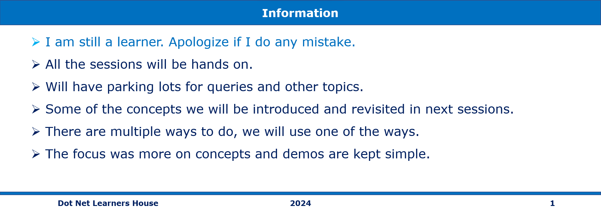

## Agenda

   - Big Picture   
   - Overview of Frontend Development Tools
   - Styling Techniques with CSS Preprocessors
   - Designing Accessible Sign-In Forms
   - Adding Interactivity with JavaScript Events
   - Implementing a Sticky Footer with CSS Grid
   - Q&A Session

## Please refer to the [Source Code](https://github.com/intikhab-h-bhat/hcj-topnavbar) of today's session for more details


## 1. Big Picture

> 1. Discussion and Demo
> 2. Understanding the Technologies:HTML, CSS, JavaScript,GitHub pages.
> 3. Creating Your Web Page.
> 4. Setting Up a GitHub Repository.
> 5. Enabling GitHub Pages.
> 6. Publishing your web page.

### Image of the hosted web site

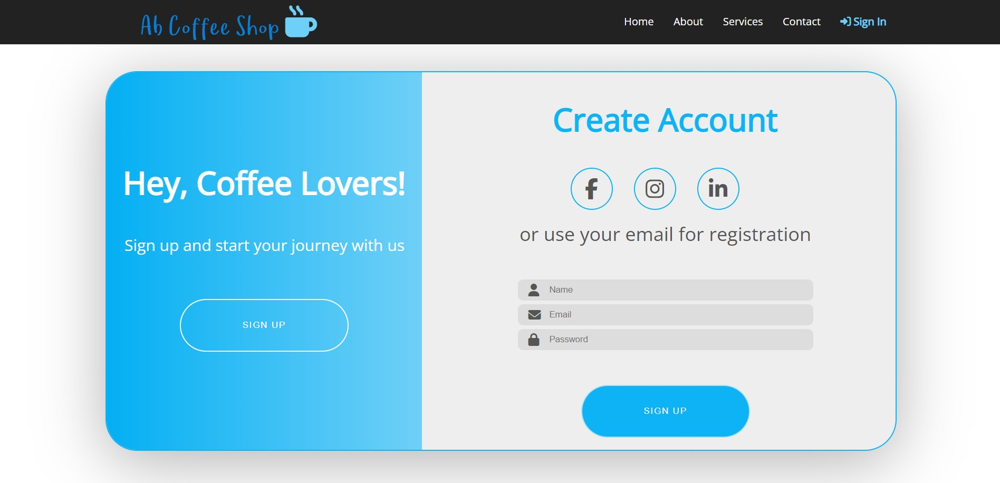

## 2. Overview of Frontend Development Tools

> 1. **HTML** is the foundation of web development. It defines the structure and content of web pages using markup tags. HTML tags are used to create elements such as headings, paragraphs, images, links, and forms.
> 1. **CSS** (Cascading Style Sheets): CSS is used to style HTML elements and define their appearance on the web page. It allows developers to control aspects like layout, colors, fonts, and spacing. CSS can be written inline, embedded within HTML, or in external style sheets.
> 1. **JavaScript** is a versatile programming language used to add interactivity and dynamic behavior to web pages. It enables features like form validation, animations and more. Like CSS JavaScript can be embedded within HTML, or in external JavaScript file.

## 3. VS Code, VS Code extensions

> 1. Discussion and Demo
> 1. **VS Code:** It is a powerful code editor which runs on your desktop and is available for Windows ,macOS and linux  and it is free also
> 1. **VS code extensions:** VS Code extensions are add-ons that enhance the functionality of the Visual Studio Code editor.These extensions can add new features, improve existing ones, or provide tools for specific programming languages.
>    - esbenp.prettier-vscode
>    - davidanson.vscode-markdownlint
>    - ms-vscode.live-server
>    - mhutchie.git-graph
>    - ms-python.debugpy

## 4. Useful resources

> 1. Discussion and Demo
> 1. [**mdn:**](https://developer.mozilla.org/en-US/) MDN Web Docs, formerly known as the Mozilla Developer Network, is a comprehensive resource for web developers. It provides documentation, tutorials, and guides covering various web technologies, including HTML, CSS and JavaScript.
> 1. [**Colourhunt:**](https://colorhunt.co/) Colour Hunt is a platform and community for discovering and sharing color palettes. It's a valuable resource for designers and developers.
> 1. [**Fontawsome:**](https://fontawesome.com/search?q=apple&o=r) Fontawsome is the most popular way to add icons to your website.
> 1. [**Favicon:**](https://favicon.io/emoji-favicons/dizzy) A favicon, short for "favorite icon," is a small image or icon associated with a website or webpage. It typically appears in the browser's address bar near title bar.
> 1. [**google fonts:**](https://fonts.google.com/) Google Fonts is a free and open-source platform provided by Google that allows users to browse, select, and use a wide variety of fonts for their web projects.
> 1. [**SVG logo maker:**](https://svglogomaker.com/) SVG Logo Maker is a simple online tool that allows you to create logos using SVG (Scalable Vector Graphics), which are ideal for high-quality graphics that can be scaled to any size without losing quality.

## 5. Starter Project

> 1. Discussion and Demo
> 1. **Starter Project:** Creating a starter app, also known as a template, can be beneficial for several reasons.
>    - It saves developers time and effort by eliminating the need to recreate the same basic structure for each new project. Instead, they can start with a pre-configured setup and focus on building unique features.
>    - Using a starter app ensures consistency across projects
>    - It establishes common practices, file structures and coding conventions, that promote uniformity within a team or across multiple projects.

## 6. Creating a `Coffee Shop's` Signin Signup form

### 6.1. Create a new repository in GitHub

> 1. On the top right corner, click on + and select 'New repository'
> 1. Create your repository using the basic template
> 1. Go to Settings --> Branches, and select 'Add branch protection rule'
> 1. Under 'Branch name pattern' write main and select 'Require a pull request before merging'
> 1. After creating branch rules clone the prject.
Under 'Code', select 'Open with Github Desktop' to clone locally.
> 1. open in VS Code, click on 'Open with Visual Studio Code'
> 1. Create the folder structure as shown below

### 6.2. Index.html

> 1. Discussion and Demo

```html
<!DOCTYPE html>
<html lang="en">

<head>
    <meta charset="UTF-8">
    <meta name="viewport" content="width=device-width, initial-scale=1.0">
    <link rel="icon" href="favicon.ico" type="image/x-icon">
    <link rel="stylesheet" href="https://cdnjs.cloudflare.com/ajax/libs/font-awesome/6.5.2/css/all.min.css"
        integrity="sha512-SnH5WK+bZxgPHs44uWIX+LLJAJ9/2PkPKZ5QiAj6Ta86w+fsb2TkcmfRyVX3pBnMFcV7oQPJkl9QevSCWr3W6A=="
        crossorigin="anonymous" referrerpolicy="no-referrer" />
    <link rel="stylesheet" href="styles.css" />
    <link rel="stylesheet" href="signin.css">
    <title>Ab's Coffee Shop</title>
</head>

<body>
<p> </p>
    <nav class="nav">
        <div class="container">
            <div class="nav-header">
                 <i class="fa-solid fa-mug-hot"></i>
            </div>
            <ul>
                <li><a href="#">Home</a></li>
                <li><a href="#">About</a></li>
                <li><a href="#">Services</a></li>
                <li><a href="#">Contact</a></li>
                <li><a href="#" class="current"><i class="fas fa-sign-in-alt"></i> Sign In</a></li>
            </ul>
        </div>
    </nav>

    <!-- <div class="main-content">
        <div class="container">
            <h1>Welcome to Ab's Coffee Shop.</h1>
        </div>
    </div> -->

    <div class="signin-container">
        <div class="form-wrapper">

            <div class="banner">
                <h1>Hey, Coffee Lovers!</h1>
                <p>Sign up and start your journey with us</p>
            </div>

            <div class="green-bg">
                <button type="button">Sign Up</button>
            </div>

            <form class="signup-form">
                <h1>Create Account</h1>
                <div class="social-media">
                    <i class="fab fa-facebook-f"></i>
                    <i class="fab fa-instagram"></i>
                    <i class="fab fa-linkedin-in"></i>
                </div>
                <p>or use your email for registration</p>
                <div class="input-group">
                    <i class="fas fa-user"></i>
                    <input type="text" placeholder="Name" />
                </div>
                <div class="input-group">
                    <i class="fas fa-envelope"></i>
                    <input type="email" placeholder="Email" />
                </div>
                <div class="input-group">
                    <i class="fas fa-lock"></i>
                    <input type="password" placeholder="Password" />
                </div>
                <button type="button">Sign Up</button>
            </form>
        </div>

    </div>
    </div>

    <footer>
        <p>&copy; 2024 Coffee Shop. All rights reserved.</p>
    </footer>

    <script src="index.js"></script>

</body>

</html>


```

### 6.3. Styles.css

> 1. Styling Techniques with CSS Preprocessors

```css
@import url('https://fonts.googleapis.com/css2?family=Roboto:wght@400;700&display=swap');
@import url('https://fonts.googleapis.com/css2?family=Montserrat:wght@900&display=swap');
@import url('https://fonts.googleapis.com/css?family=Open+Sans');

* {
  margin: 0;
  padding: 0;
  outline: none;
  box-sizing: border-box;
}

body {
  font-family: 'Open Sans', 'Roboto', 'Montserrat', sans-serif;
  line-height: 2.2;
  font-size: 0.875rem;
  color: #1C1678;
  min-height: 100vh;
  /* Set minimum height to full viewport height */
  position: relative;
  /* Set position to relative for footer positioning */
}

.container {
  max-width: 1200px;
  margin: 0 auto;
}

.nav {
  position: fixed;
  background-color: #222;
  top: 0;
  left: 0;
  right: 0;
  transition: all 0.3s ease-in-out;
  z-index: 1000;
  /* Ensure the navbar is above other content */
}

.nav .container {
  display: flex;
  justify-content: space-between;
  align-items: center;
  padding: 1px 0;
  transition: all 0.3s ease-in-out;
}

.nav-header {
  display: flex;
  align-items: center;
  justify-content: space-between;
  padding: .2rem;
}

.nav-header i {
  color: #6fd0f7;
  font-size: 3rem;
}

.nav ul {
  display: flex;
  list-style-type: none;
  align-items: center;
  justify-content: center;
  font-size: 1rem;
}

.nav a {
  color: #fff;
  text-decoration: none;
  padding: 7px 15px;
  transition: all 0.3s ease-in-out;
}

.nav.active {
  background-color: #fff;
  box-shadow: 0 2px 10px rgba(0, 0, 0, 0.3);
}

.nav.active a {
  color: #000;
}

.nav.active .container {
  padding: 10px 0;
}

.nav a.current,
.nav a:hover {
  color: #6fd0f7;
  font-weight: bold;
}

.main-content {
  height: 36vh;
  display: flex;
  flex-direction: column;
  justify-content: center;
  align-items: center;
  text-align: center;
  position: relative;
  /* margin-bottom: 10px; */
  z-index: -2;
}

h1 {
  font-size: 3rem;
  margin-bottom: 1rem;
}

.content h2,
.content h3 {
  font-size: 150%;
  margin: 20px 0;
}

.content p {
  line-height: 30px;
  letter-spacing: 1.2px;
}

footer {
  margin-top: auto;
  background-color: #585656;
  color: #fff;
  text-align: left;
  padding: 15px 20px;
  bottom: 0;
  left: 0;
  width: 100%;
}

```
### 6.4. signin.css
```css

> 1. Designing Accessible Sign-In Forms

.signin-container {
    margin-top: 1.8rem;
    width: 100%;
    height: 100vh;
    display: flex;
    justify-content: center;
    align-items: center;
    margin-bottom: 0;
}

.form-wrapper {
    width: 75rem;
    height: 36rem;
    background-color: #eee;
    border-radius: 3rem;
    box-shadow: 0 1rem 6rem rgba(0, 0, 0, 0.3);
    position: relative;
    overflow: hidden;
    border: 0.1rem solid #0eb3f5;
}

.banner {
    position: absolute;
    top: 20%;
    left: -36rem;
    text-align: center;
    color: #fff;
    width: 35rem;
    z-index: 100;
    transition: left 0.8s;
}

.signin-container.change .banner {
    left: -2.50rem;
}

.banner h1 {
    font-size: 3rem;
    margin-bottom: 1rem;
}

.banner p {
    font-size: 1.5rem;
}

.green-bg {
    width: 100%;
    height: 100%;
    background: linear-gradient(to right, #04aff3, #6fd0f7);
    position: absolute;
    top: 0;
    left: 0;
    z-index: 50;
    transition: width 1.5s cubic-bezier(0.19, 1, 0.22, 1);
}

.signin-container.change .green-bg {
    width: 40%;
}

.green-bg button {
    position: absolute;
    top: 60%;
    left: 50%;
    transform: translateX(-50%);
    width: 16rem;
    height: 5rem;
    background-color: transparent;
    border: 0.1rem solid #fff;
    border-radius: 3rem;
    text-transform: uppercase;
    letter-spacing: 0.1rem;
    color: #fff;
    cursor: pointer;
}

.green-bg button:hover {
    background-color: #fff;
    color: #0eb3f5;
    border: 0.1rem solid #024762;
}

.signup-form {
    width: 60rem;
    height: 100%;
    position: absolute;
    top: 0;
    left: 0;
    display: flex;
    flex-direction: column;
    justify-content: space-around;
    align-items: center;
    padding: 1rem 0;
    transition: left 1.5s cubic-bezier(0.19, 1, 0.22, 1);
}

.signin-container.change .signup-form {
    left: 23rem;
}

.signup-form h1 {
    font-size: 3rem;
    color: #0eb3f5;
}

.social-media {
    display: flex;
}

.social-media i {
    width: 4rem;
    height: 4rem;
    border: 0.1rem solid #0eb3f5;
    border-radius: 50%;
    display: flex;
    justify-content: center;
    align-items: center;
    margin-right: 2rem;
    font-size: 2rem;
    color: #555;
    cursor: pointer;
}

.signup-form p {
    font-size: 1.8rem;
    color: #555;
    margin-bottom: 2rem;
}

.input-group {
    position: relative;
}

.input-group input {
    width: 28rem;
    height: 2rem;
    padding: 1rem 1rem 1rem 3rem;
    background-color: #ddd;
    border: none;
    border-radius: 0.5rem;
}

.input-group i {
    position: absolute;
    top: 50%;
    left: 1rem;
    transform: translateY(-50%);
    font-size: 1.2rem;
    color: #555;
}

.signup-form button {
    width: 16rem;
    height: 5rem;
    background-color: #0eb3f5;
    border: none;
    border-radius: 3rem;
    text-transform: uppercase;
    letter-spacing: 0.1rem;
    color: #fff;
    margin-top: 3rem;
    cursor: pointer;
    border: 0.1rem solid #ade0f4;
}

.signup-form button:hover {
    background-color: #fff;
    color: #0eb3f5;
    border: 0.1rem solid #024762;
}
```
### 6.5. Script.js

>..Adding Interactivity with JavaScript Events

```javascript
const nav = document.querySelector('.nav')
window.addEventListener('scroll', fixNav)

function fixNav() {
  if (window.scrollY > nav.offsetHeight + 150) {
    nav.classList.add('active')
  } else {
    nav.classList.remove('active')
  }
}

const container = document.querySelector(".signin-container");
const signUpBtn = document.querySelector(".green-bg button");

signUpBtn.addEventListener("click", () => {
  console.log(container.classList);
  
  container.classList.toggle("change");
});

```

## 7. Verify the changes locally

> 1. Discussion and Demo

## 8. Publishing the web page using GitHub pages

In GitHub go to your repository you want to publish.
click on Settings tab.

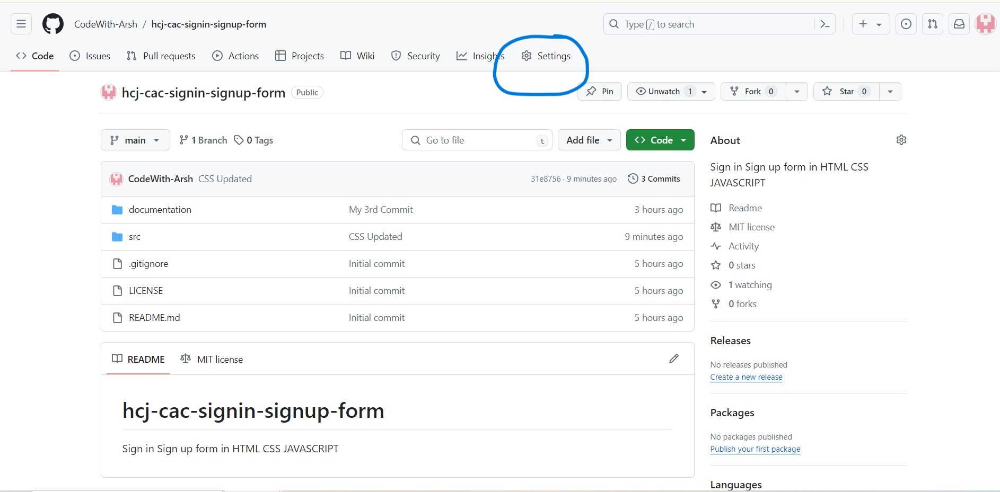

click on pages in left side menu

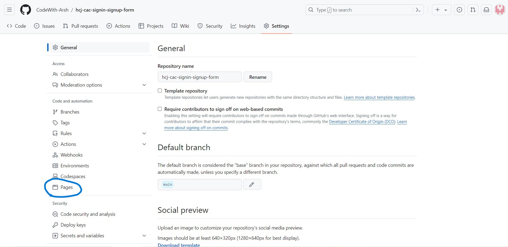

selct the dropdown Deploy from branch on the right side and click on GitHub Actions
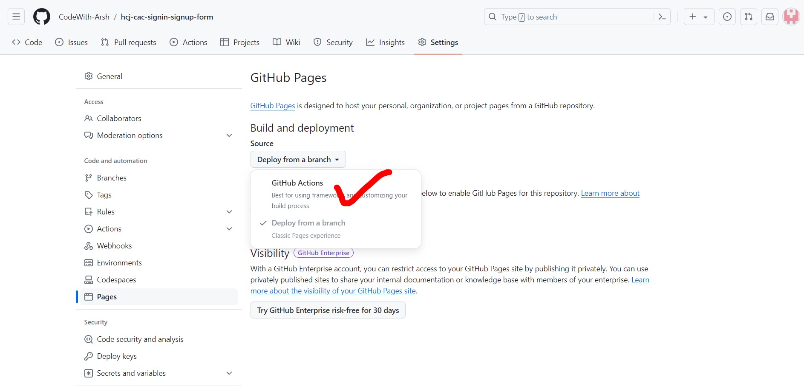

Then click on Configure button

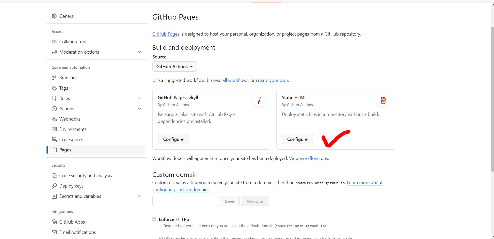

Then click on Commit changes green button on the right side

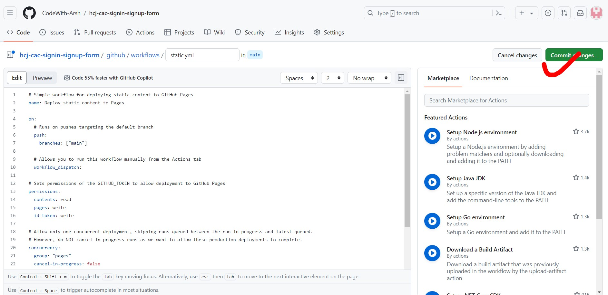

After clicking on Commit changes a pop up
will open selct commit directly to the main branch and then click on Bypass rules and commit changes

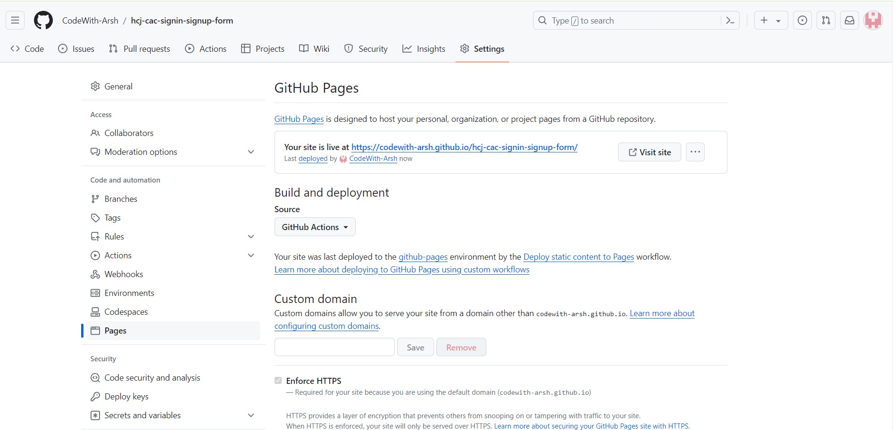

After that Go to settings->pages
and click on the link or visit site button on the right side and your web page is published

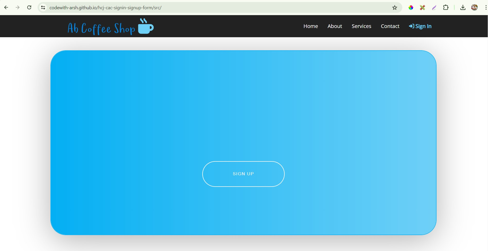[https://codewith-arsh.github.io/hcj-cac-signin-signup-form/src/]


---

## 9. Summary / Q&A

1. SUMMARY / RECAP / Q&A
2. Any open queries, I will get back through meetup chat/twitter.

<!-- ## 10. Appendix A -->

<!-- > 1. List of Images

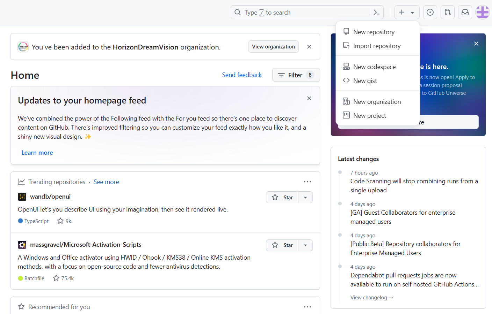

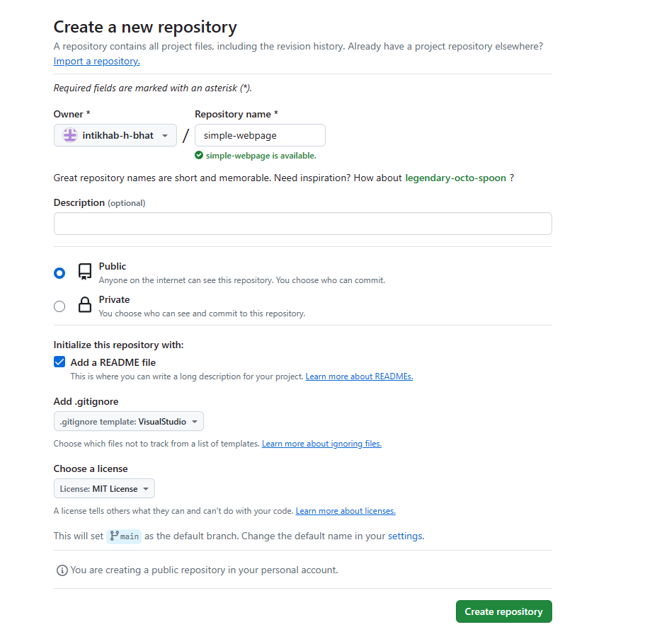

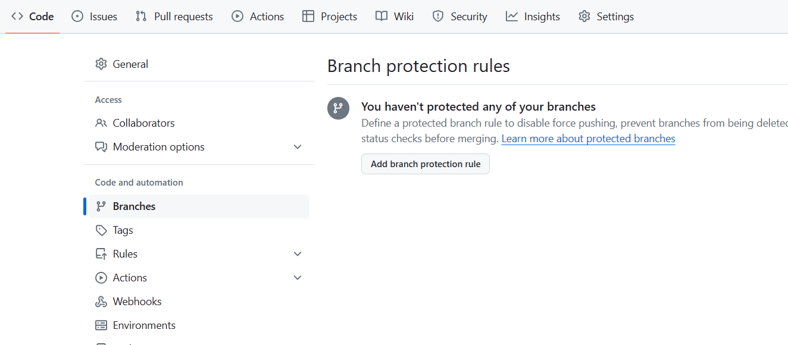

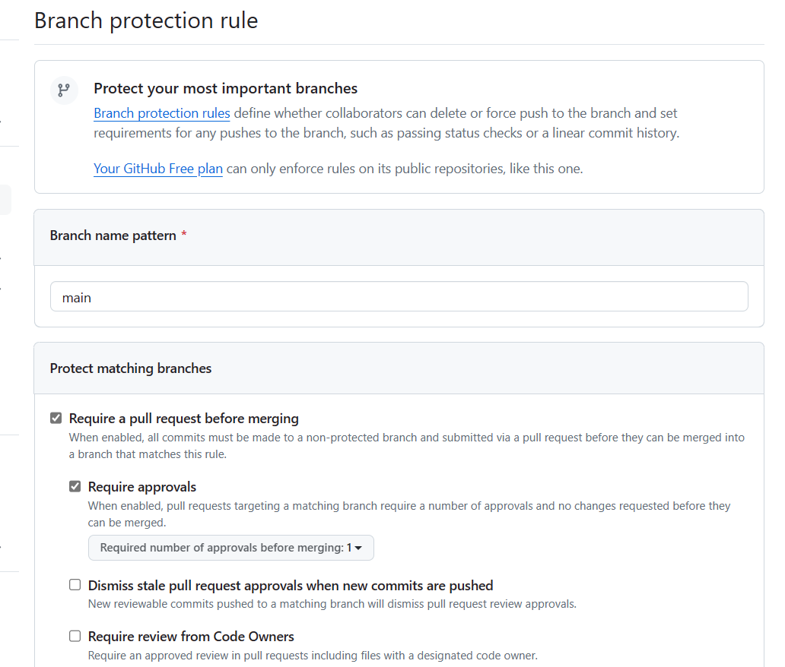

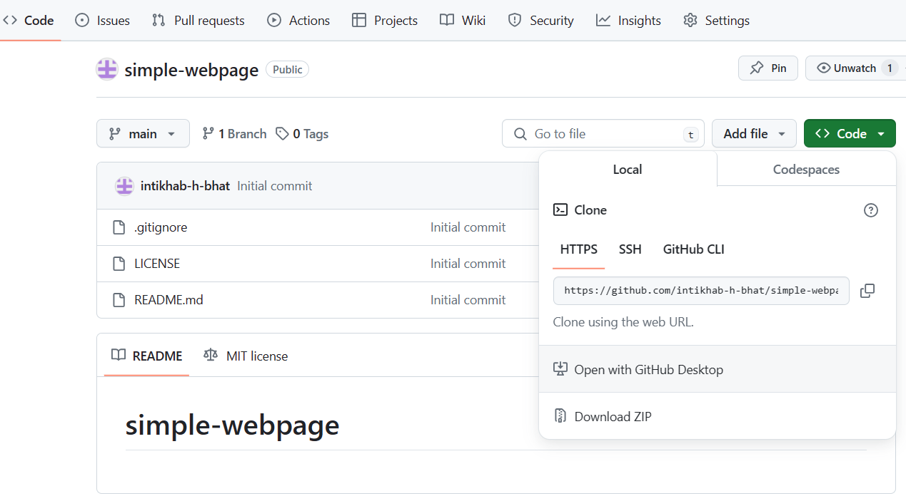

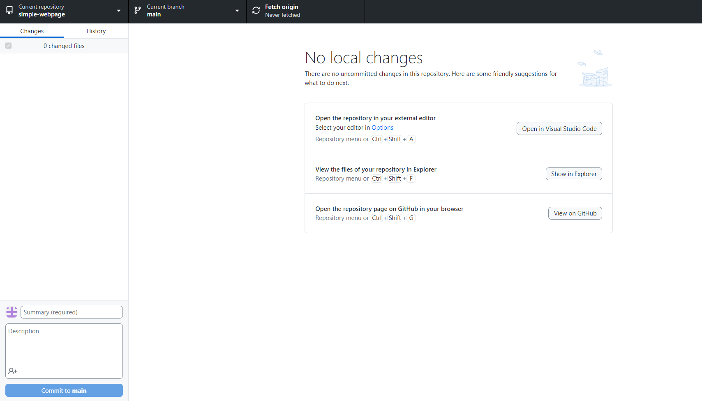

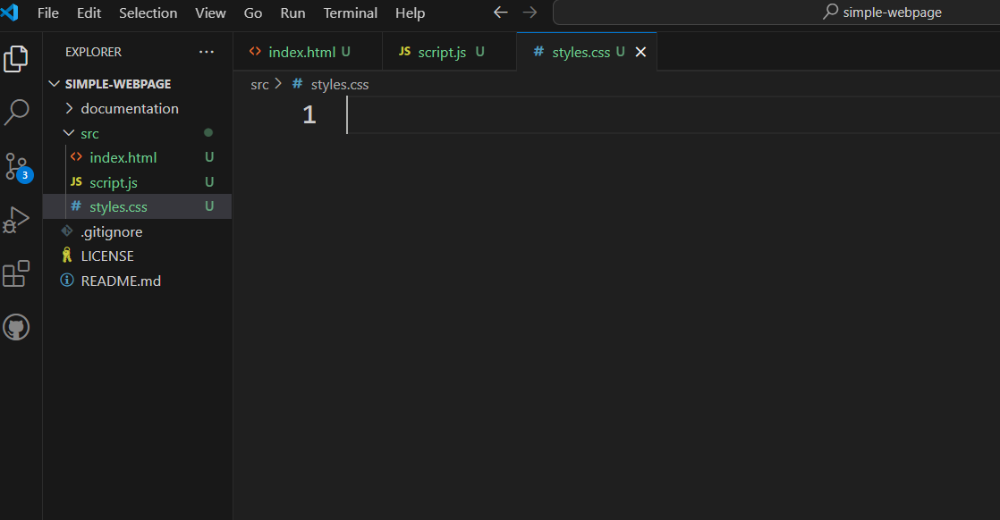 -->
